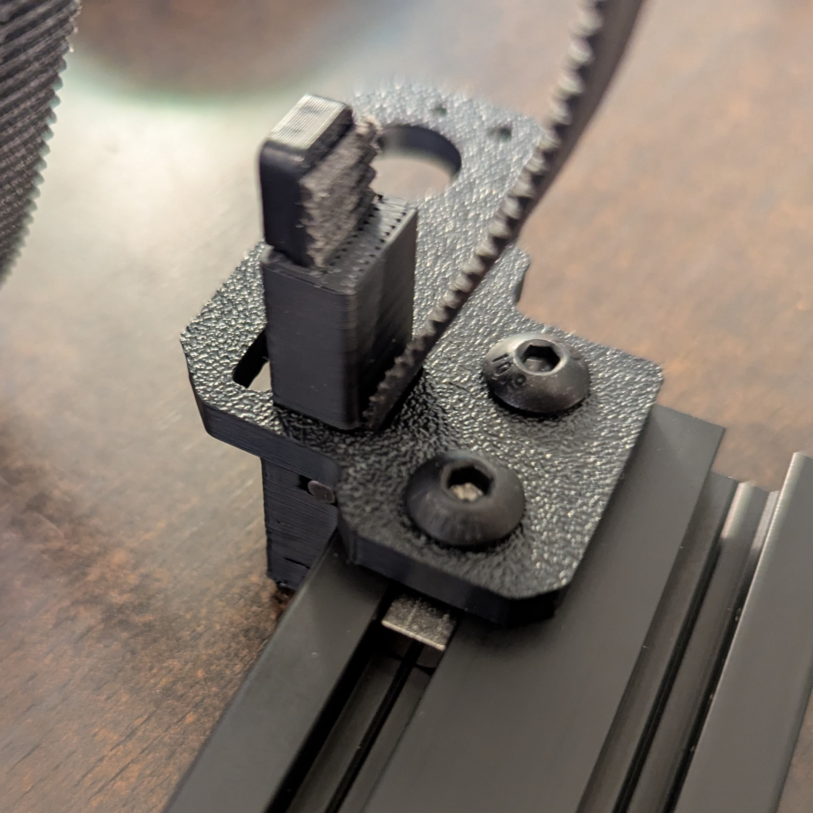
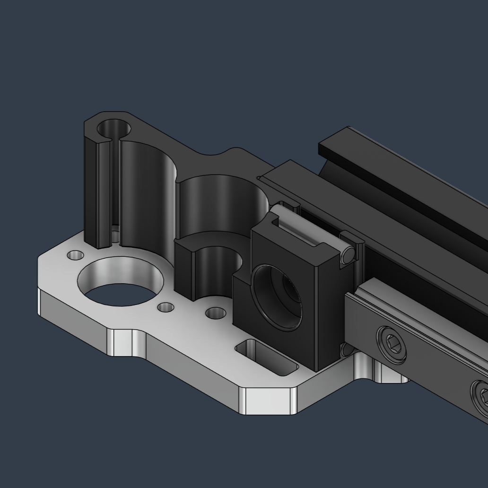
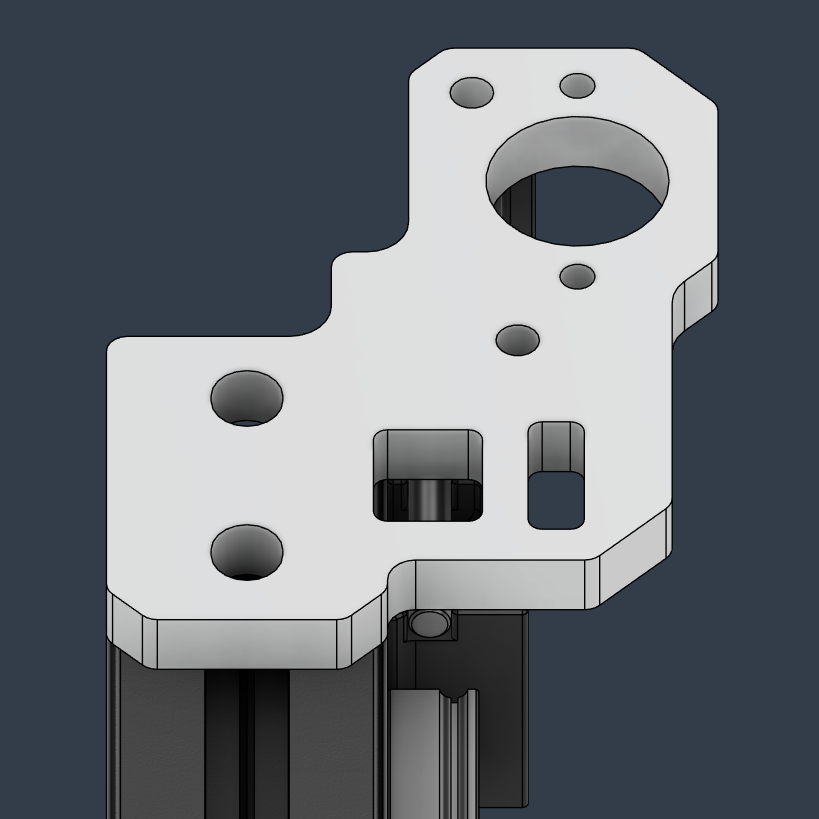

# January 27, 2025
## Flying gantry Z-belt pins - RC2 Gantry Update
Today I looked at the possibility of implementing the same Z-belt pin method, that's present in the CNC kits into the sheet metal one.

The biggest issue with RC1 is that the Z belts have to be pre-installed if someone's using the printed alignment helpers. So I wanted to see if we can improve on that. Unfortunately, with the NP rail clearance and the larger OD of the M5 BHCS screw, there's very little material left around the pins, so I'm left with these options:
**1.** Ditch the printed middle parts entirely for the sheet metal gantry, that way there's no added difficulty when installing the Z-belts, but the plates would still have to be chamfered there ideally.
**2.** Make a simpler printed part for the 2 pins without helping with the plate alignment. I would have to look into this more because of the clearances on configs.

I'm gravitating towards the former because the sheet metal gantry BOM is already complicated enough and there isn't a lot more I can do to help with the plate alignment anyway. Also, the whole thing looks better without the printed parts.

