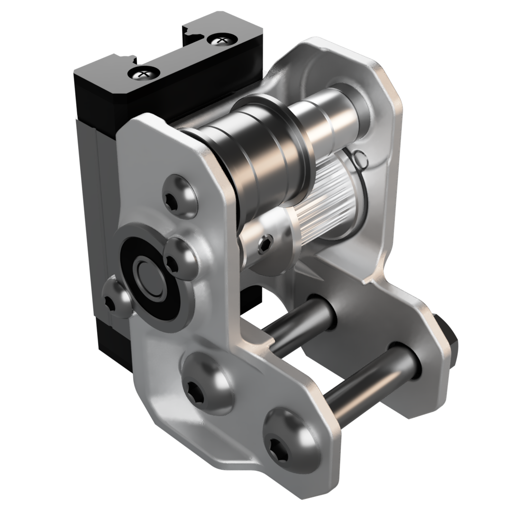
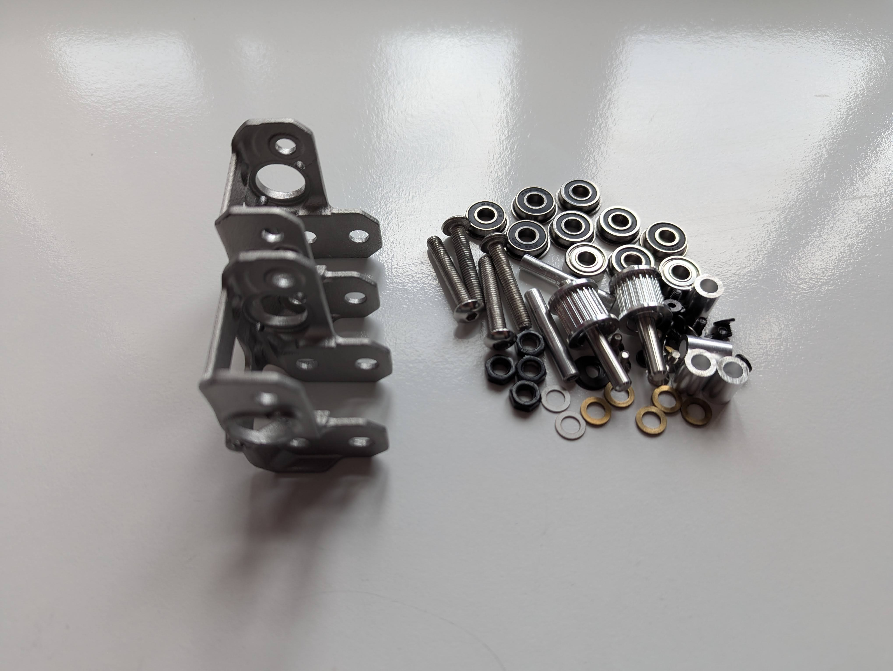
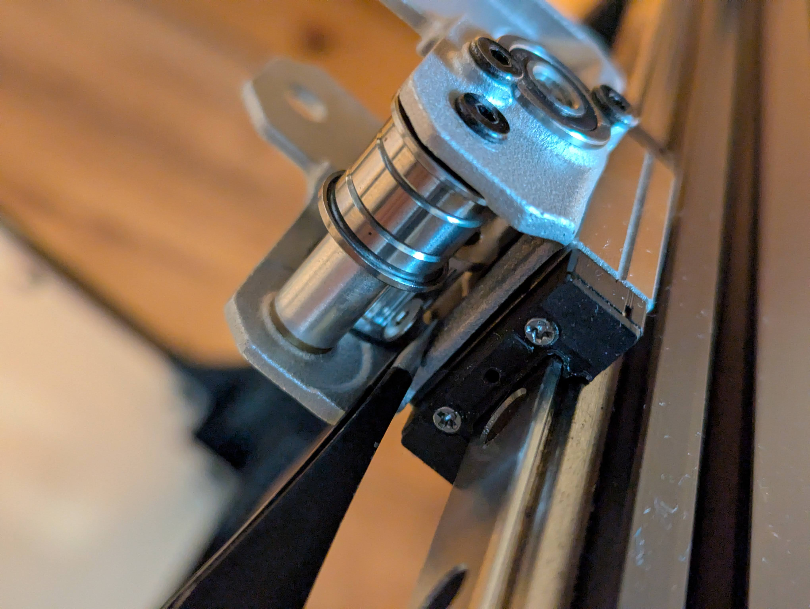
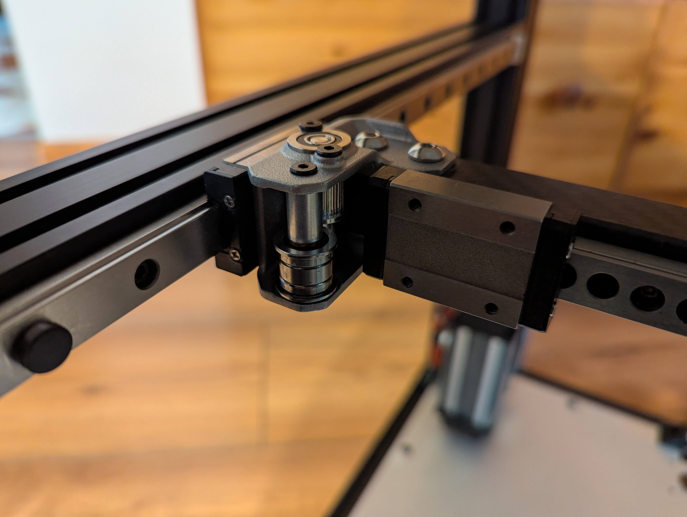
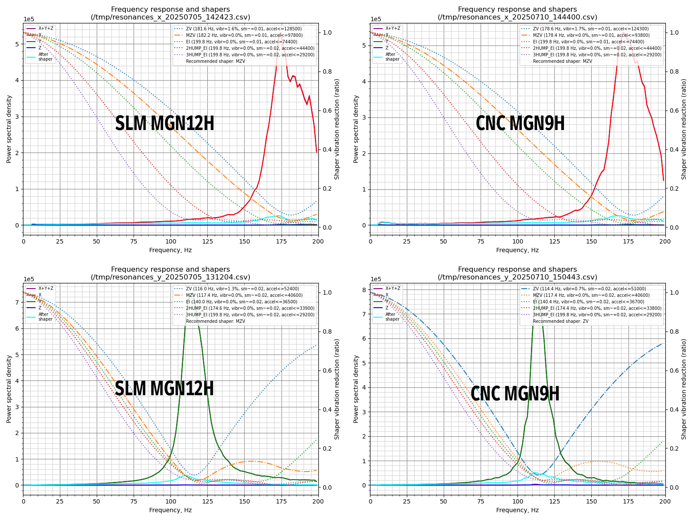
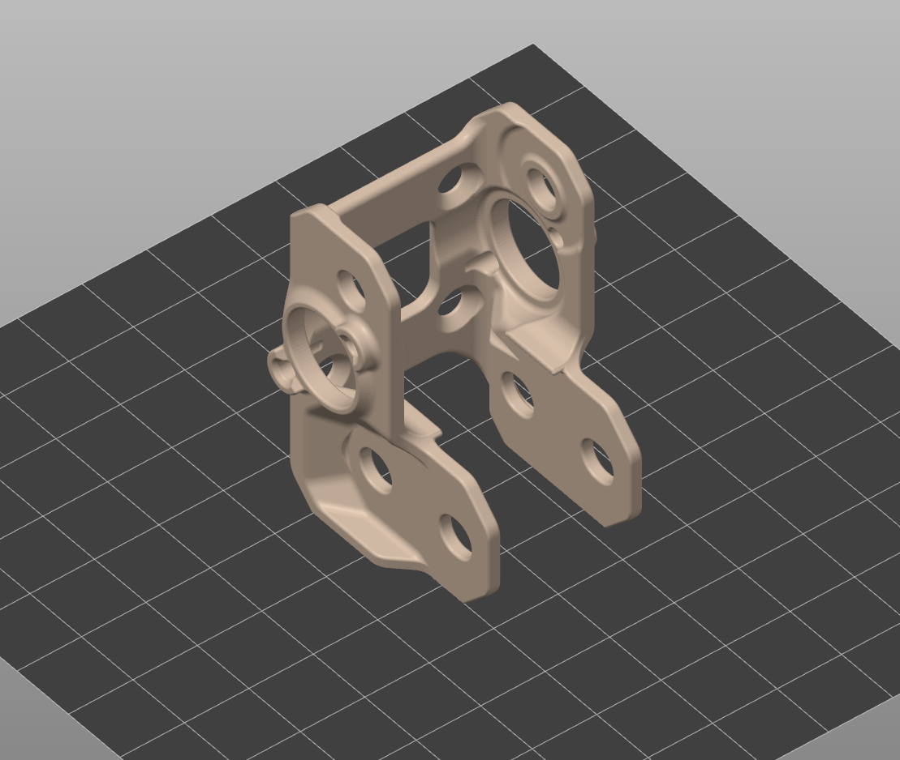

# SLM MGN12H XY-Joints
> [!WARNING]
> **This is only a deeply flawed user mod and a dead end, not an officially supported configuration. It won’t receive any updates. Do it at your own risk! You are definitely better off getting 9Hs for your build.**

### Pros:
- You get MGN12Hs on Y with the unmodified Monolith belt path and without X-travel loss.
### Cons:
- Due to space constraints, the SLM part has to be really thin, and it’s very prone to warping.
- It requires a lot of post-processing, and you have to make sure the mounting surface is flat when it’s completely assembled.
- Hard to assemble and align.
- More severe bimetallic expansion, 2040 Y-extrusions, and/or backers are required.
- No performance advantage compared to MGN9H.
## Assembly

## Vs. LDO MGN9H milled XY-joints in the same environment

## SLM orientation

## BOM
| Quantity | Part Name |
| ------------- | ------------- |
| 2 | SLM MGN12H XY-joint |
| 8 | F695 flanged bearing | 
| 2 | 695 W5 bearing |
| 2 | M5x0.5mm shim |
| 8 | M3x5 FHCS |
| 2 | M3xD5x30 threaded round standoff |
| 8 | M3x4 BHCS |
| 4 | M3x6 BHCS |
| 8 | M5x1mm shim |
| 2 | D5x40 smooth pin |
| 6 | M5xD8x5 spacer |
| 2 | GT2 20T 9mm pulley de-hubbed |
| 4 | M4x2.5 set screw |
| 2 | Di=5mm L0=5mm compression spring |
| - | Mounting hardware for your X-beam |
